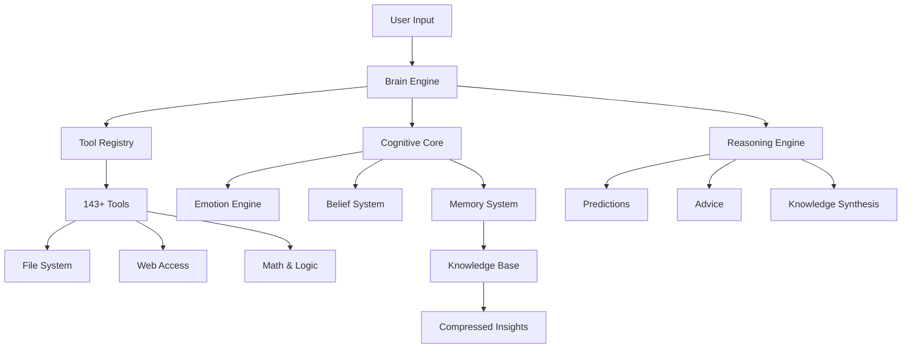
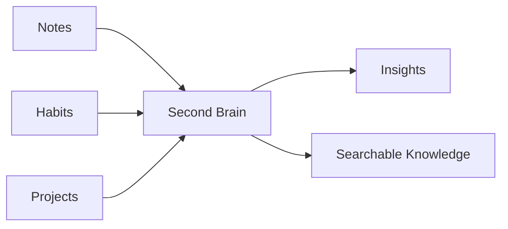

# 🧠 Artificial Agent System

### *A Living, Learning, Reasoning AI Architecture*

<p align="center">
  
  
  
  
</p>

<p align="center">
  
  
</p>

---

## 🎬 Demo Preview

<p align="center">
  <a href="https://drive.google.com/file/d/1iTJzU7fk2ev9BQ3HzMKvrsvWaA-G73uM/view?usp=drive_link">
    ▶️ Watch Demo Video
  </a>
</p>


> ⚡ *Not a chatbot. A cognitive system that thinks, learns, and evolves.*

---

## 🚀 What is This?

This project is a **Layered Artificial Agent Architecture** that simulates:

* 🧠 Thinking (Cognitive Core)
* ⚡ Acting (Tool-Based Agency)
* 📚 Remembering (Knowledge + Memory)
* 🔄 Learning (Autonomous System)
* 🧩 Reasoning (Advanced Intelligence)

With **143+ tools**, persistent memory, and autonomous learning, it behaves like a **proto-AGI system**. 

---

## 🧩 System Architecture



---

## ✨ Features That Actually Matter

### 🧠 Cognitive Intelligence

* Identity, memory, beliefs
* Emotional awareness
* Meta-cognition

---

### ⚡ Agent Capabilities

* 143+ tools across domains
* File + system interaction
* Web intelligence
* Logical computation

---


* Learns every 15–30 mins
* Parallel topic exploration
* Stores insights automatically
* Expands knowledge continuously 

---

### 🧠 Second Brain (Your External Memory)



* Smart notes
* Habit tracking
* Project management
* Instant recall system 

---

## 🛠️ Tech Stack

<p align="center">
  
</p>

* Python 3.8+
* Modular AI architecture
* JSON-based persistence
* Custom reasoning engine

---

## ⚙️ Installation

```bash
git clone https://github.com/your-username/your-repo.git
cd your-repo
pip install -r requirements.txt
```

---

## ▶️ Run the System

```bash
python main.py
```

### 🎤 Voice Mode

```bash
python main.py --voice-chat
```

---

## 🧪 Example Usage

```bash
You: "learn about neural networks"
AI: Adds topic to learning queue

You: "note: async improves performance #python"
AI: Saved in second brain

You: "give advice on productivity"
AI: Uses reasoning + memory to respond
```

---

## 📊 System Metrics

| Feature              | Value      |
| -------------------- | ---------- |
| 🔧 Tools             | 143+       |
| 🧠 Reasoning Engines | 5          |
| 📚 Knowledge Base    | 100+ facts |
| ⚡ Response Time      | ~0.03s     |
| 🔄 Learning Mode     | Autonomous |

---

## 🧠 Core Philosophy

> “Don’t just respond.
> Understand. Learn. Evolve.”

This system is built to simulate:

* Thought
* Growth
* Intelligence

—not just conversation.

---

## ⚠️ Limitations

* Emotion detection still improving
* Memory retrieval needs optimization
* Curiosity engine is basic

(aka: it’s evolving 👀) 

---

## 🚀 Roadmap

* Vector embeddings
* Semantic memory
* ML-based reasoning
* Multi-agent collaboration
* Robotics + IoT integration

---

## 🤝 Contributing

Want to build AGI instead of just talking about it?

```bash
Fork → Improve → PR → Repeat
```

---

## ⭐ Support

If this project made you go *“yo this is actually insane”*:

👉 Drop a star ⭐
👉 Share it
👉 Build on it

